# Domain and data modeling with Appsync and DynamoDB

With REST we had an architectural style with a set of constraints that lets you interfact with Resources.
The advent of GraphQL emphasized the fuzziness of those constraints by providing a full blown specification that defines the conceptual model as a graph.
Despite graphs' simplicity, they have a rich structure making them very efficient at representing hierarchical data, with and without cicles (in case of connected acyclic graphs we get simple trees).

## Advantages of GraphQL with API design
* Eliminates overfetching and underfetching problems as the request should be fulfilled in a single round trip to the backend and contain only the necessary data;
* Has built in type safety;
* Reduces the amount of client side joins, error handling and retry logic.


## Thinking in Graphs and DDD
Taking bits from Eric Evans' Domain-Driven Design book, in domain modeling we shouldn't separate concepts from their implementation. Thus we need to remove the sequentiality of the process "design, then build".
During the developement phase, domain experts and technologists interact with each other (using an Ubiquitous Language) trying to find the best domain representation while addressing business goals.
As time advances, technologists will become more familiar with the scenario and will eventually modify the domain model many times.

When developing new APIs in GraphQL it's possible to reuse the same endpoints and just focus on connecting elements to the graph by expanding the schema. Clients won't need to make new integrations, as they can simply ask for more/different fields and data will still be served in a single request.

Evans is an Extreme Programming supporter, but at this point it's pretty obvious that GraphQL is a great fit for multiple iterations across the graph's schema.


## The services we're using
In this article, we're going to use AppSync, a fully managed GraphQL service, and DynamoDB the most famous NoSQL serverless database.

When performing an operation, in Appsync it's possible to make use of different resolvers for fetching nested fields for a given return type.
These resolvers may get the data from the same datasource of the parent type or from another one (or a combination of both, depending on how you modeled your domain).

Now we need to make a difficult choice:
  1. Leveraging Single-Table Design and store everything in a single DynamoDB table;
  2. Use DynamoDB pretty much like a SQL database and create a new table for each data model.


**The purpose of this article is to compare the effectiveness of each approach by executing three queries with different nesting levels.**


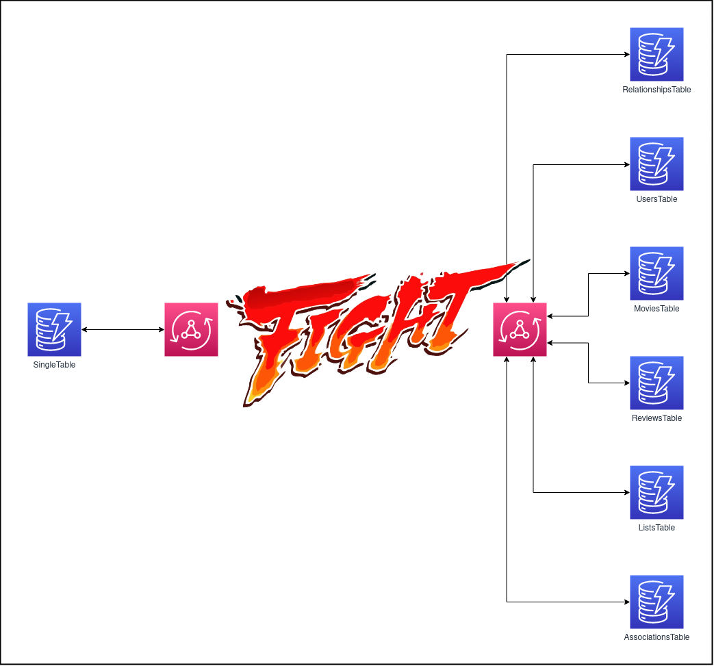

---
## Domain Model

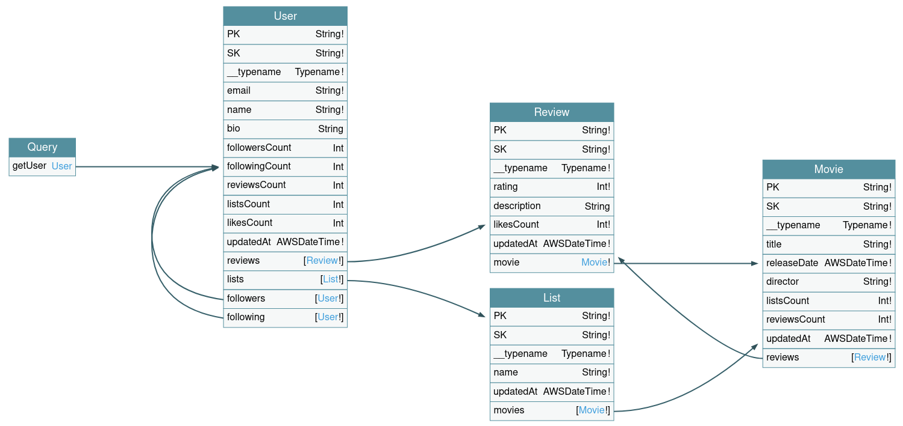

```gql
schema {
  query: Query
}

type Query {
  getUser(userID: String!): User
}

type User {
  PK: String!
  SK: String!
  __typename: Typename!
  email: String!
  name: String!
  bio: String
  followersCount: Int
  followingCount: Int
  reviewsCount: Int
  listsCount: Int
  likesCount: Int
  updatedAt: AWSDateTime!

  # nested
  reviews: [Review!]
  lists: [List!]
  followers: [User!] # we can use pipelines here!
  following: [User!] # here too!
}

type Review {
  PK: String!
  SK: String!
  __typename: Typename!
  rating: Int!
  description: String
  likesCount: Int!
  updatedAt: AWSDateTime!

  # nested
  movie: Movie!
}

type Movie {
  PK: String!
  SK: String!
  __typename: Typename!
  title: String!
  releaseDate: AWSDateTime!
  director: String!
  listsCount: Int!
  reviewsCount: Int!
  updatedAt: AWSDateTime!

  # nested
  reviews: [Review!]
}

type List {
  PK: String!
  SK: String!
  __typename: Typename!
  name: String!
  updatedAt: AWSDateTime!

  # nested
  movies: [Movie!]
}

enum Typename {
  USER
  MOVIE
  REVIEW
  LIST
  ASSOCIATION
  FOLLOW
}

```


## Data Model

Here's how I structured the Single Table that contains all the information about users, movies, reviews and lists.
(Data might be inconsistent due to auto generated values).
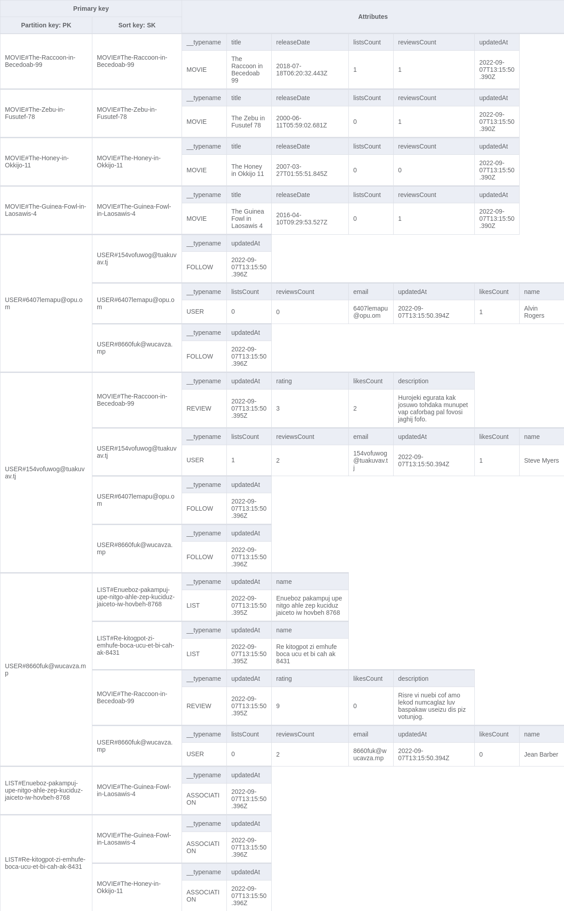

While, for the Multi Table Design every table contains only elements with the same data model. 

The loaded data is the same for both approaches.

---
## Query 1:
```gql
 query MyQuery($userID: String!) {
    getUser(userID: $userID) {
      PK
      following {
        PK
        SK
      }
    }
  }
```


Results:

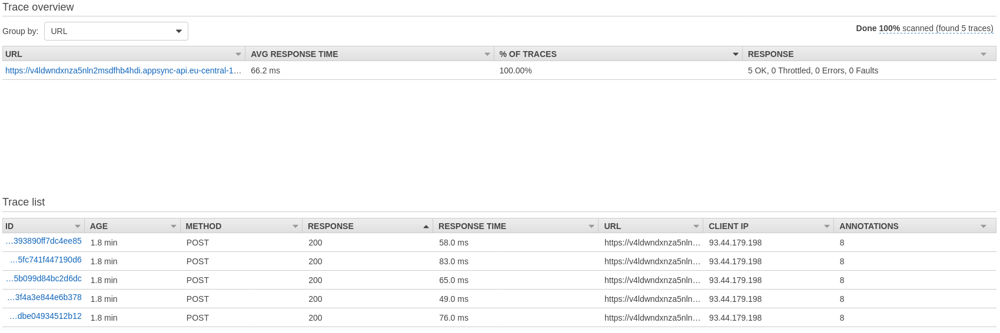
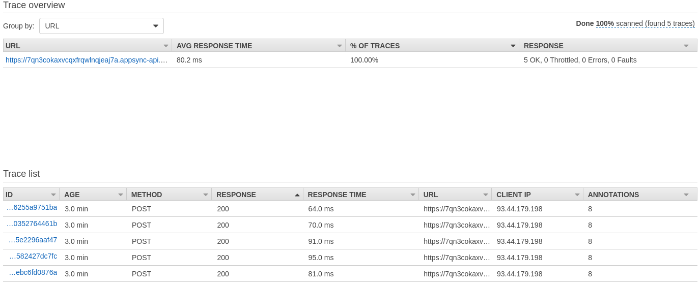


## Query 2:
```gql
 query MyQuery($userID: String!) {
  getUser(userID: $userID) {
    PK
    following {
      PK
      SK
      reviews {
        PK
        SK
      }
    }
  }
}
```


Results:


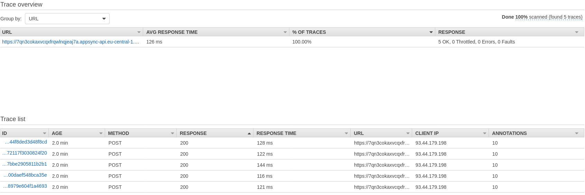


## Query 3:
```gql
  query MyQuery($userID: String!) {
    getUser(userID: $userID) {
      PK
      following {
        PK
        SK
        reviews {
          PK
          SK
          movie {
            PK
            SK
          }
        }
      }
    }
  }
```


Results:

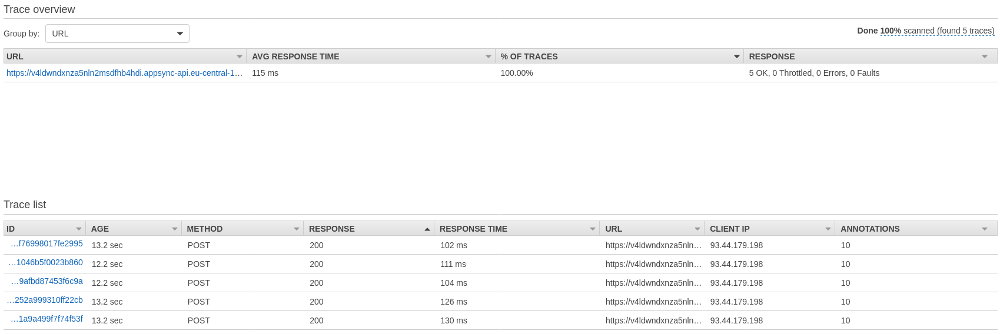
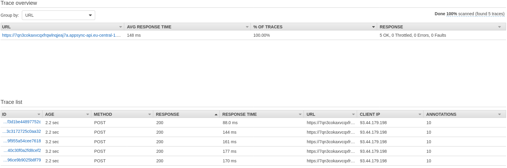

---


## Data Loader pattern
Hot take: Appsync doesn't implement the DataLoader pattern, or at least not in the way you might think of.
On the [Appsync Architecture page](https://docs.aws.amazon.com/appsync/latest/devguide/system-overview-and-architecture.html) we get to know that resolvers are executed concurrently, as you would do in a set of promises in JS via Promise.all(). This implies that the total number of database accesses is not optimized when using normal DynamoDB VTL resolvers.

Here's the detailed X-Ray report of the Query no. 3:
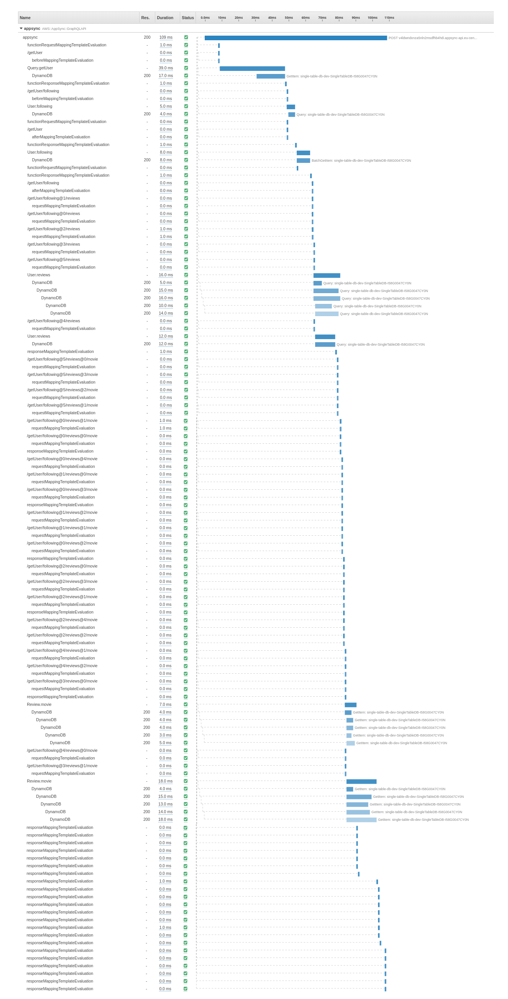

Request and Response mappings, as well as Database accesses for the same nested `Type` are executed almost at the same time.

When we look at the database access, that is even clearer:
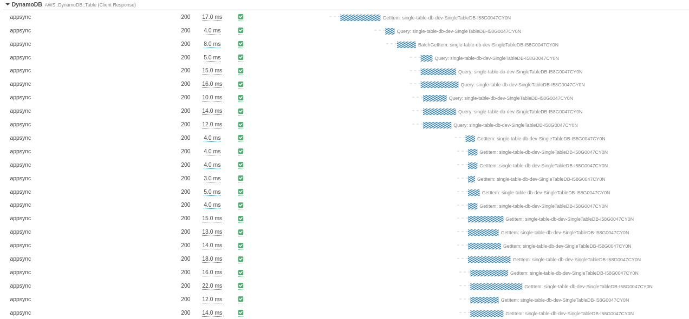

A series of GetItem-based resolvers of the same `Type`, on the same datasource are launched in parallel, as configured.
There's no trace of **intelligent batching** here.

In order to really have the DataLoader functionality we have to deeply know the Data models and do everything by ourselves with Lambdas resolvers by interpreting the query or making use of [external libraries](https://github.com/graphql/dataloader).

---

## Domain Modeling and Data Modeling
While good Domain modeling is necessary to create useful APIs, Data modeling is not required when you have a GraphQL API in place.

### Access Patterns
Knowing our access patterns is mandatory to design our data model and run efficient, predictable queries.

Pre-joining data via Single Table Design allows us to leverage the internal DynamoDB structure based on partitions and B-trees to fetch all the necessary data (often) in a single round trip. But comes at the big cost of Denormalization.

As the application grows and domain models evolve, we might need to add new access patterns or modify the ones already in place. This can be difficult and eventually lead to a complete redesign of the Data model.

### Denormalization
Denormalizing a big SQL database and migrate it to DynamoDB (or, in reality, to any noSQL database) is a huge burden and needs to be done very carefully in order to keep the 'relational value' of the data (wink to Rick Houlihan for me if you see him around).

The denormalization step is very "sequential", and here we see the first discrepancy with DDD. Denormalization can happen only after you've defined the access patterns (as adding more would be a pain) and and migrated the existing data, spread across multiple tables, into a single table (which translates to operational load and, in the worst case, downtime).


### Are there any advantages?
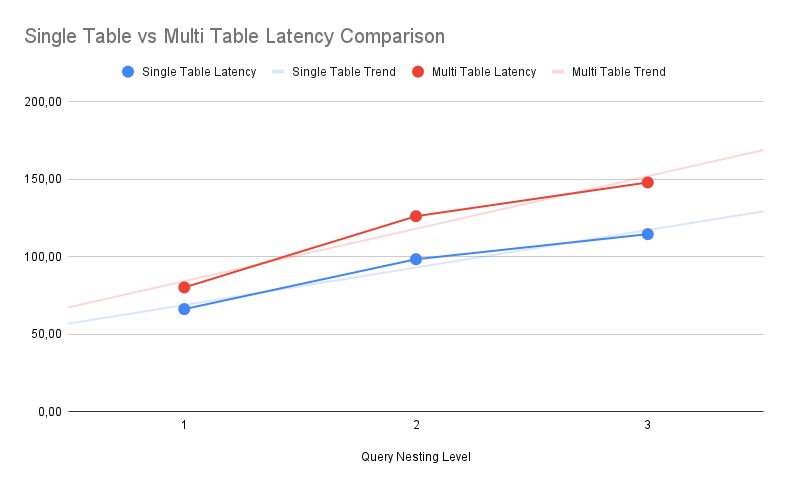

In my comparison it's pretty clear that Single-Table Design is more efficient in terms of bare latency, but is it worth it?

The efficiency gains can be easily surpassed by the ease of use (no complex custom VTL logic).

I don't want to start a philosophical debate but the serverless proposition is about saying goodbye to everything that doesn't bring direct value to the project.

Let's imagine the following scenario:
You've just launched a big OLTP service that relies solely on Serverless products from AWS.
The first big development phase has just finished, and you're trying to prepare for the next sprints when a colleague asks: "Can you please provide me the number of apple orders executed within the dates X and Y from customers that live in Taiwan that don't have pears in their fridge?"

DynamoDB is not meant for analytical applications (it doesn't even have the simplest aggregation functions like SUM or MAX). And you haven't prepared any infrastructure that can handle such a complex query.

If the application data is spread across multiple tables and for each table, the data model is consistent, we can easily export that data to build aggregations and run queries via Athena, Redshift, or Glue (Crawlers are cool!).

If we favored a Single Table Design, we're most likely going to write a custom script/application that will make a lot of requests and logically join the data. Then we'd probably start scratching our heads trying to figure out how to include that access pattern (maybe using metadata objects).

What happens if, the subsequent day, our curious colleague asks for a completely different type of information? I believe I’ve made my point.


## Final thoughts

If you're bootstrapping a new project it's better to go for a multi-table approach, because:
* Queries' latencies won't matter much during development phase;
* You will know the domain and business needs better, so you will change access patterns very often

If you're migrating a long-running product that's relying on a SQL database to DynamoDB:
* Going for a Single Table Design might be the right choice because access patterns are well-defined.

In general, if you want to improve your solution's overall latencies Single Table Design might do the trick.
If speed is your concern, have a look at the different caching mechanisms in AWS, they might serve you better.


---
Additional readings on the topic:
* [AWS Blog on DynamoDB modeling](https://aws.amazon.com/blogs/database/single-table-vs-multi-table-design-in-amazon-dynamodb/)
* [AWS Blog on Appsync and Single Table Design](https://aws.amazon.com/blogs/mobile/enhancing-dynamodb-single-table-design-with-appsync-access-and-security-features/)
* [Rick Houlihan's office hours](https://www.youtube.com/watch?v=I-L89SpoDxI&list=PLJo-rJlep0EDiOJaqZV0FjO0Ts3CmKy-W&index=12)
* [Alex De Brie's post](https://www.alexdebrie.com/posts/dynamodb-graphql/)
* [Alex De Brie's video](https://www.youtube.com/watch?v=rlypcHUlsao)
* [Alex DeBrie's DynamoDB analysis](https://www.alexdebrie.com/posts/dynamodb-paper/), or if you feel brave enough the full [DynamoDB paper](https://www.usenix.org/conference/atc22/presentation/elhemali)
* [Awesome DynamoDB Repo](https://github.com/alexdebrie/awesome-dynamodb)
* [Benoit Boure's post](https://benoitboure.com/how-to-use-dynamodb-single-table-design-with-appsync)
* [Rafal Wilinski's lessons](https://www.rwilinski.me/blog/dynamodb-single-table-design-lessons/)
* [Paul Swail's comparison](https://serverlessfirst.com/dynamodb-modelling-single-vs-multi-table/)

